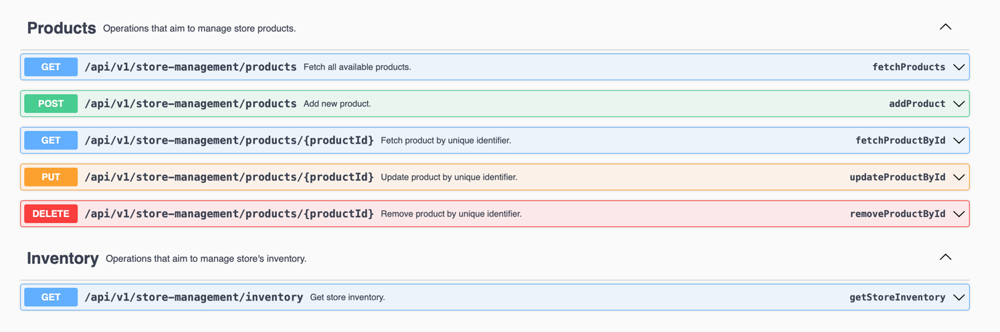

<br>
<div align="center">

 <a href="."></a>
 <a href="."></a>
 <a href="."></a>
 <a href="."></a>
</div>

<div>
<h2 align="center">Store Management Tool [SMT]</h2>

  <p align="center">
    ___________________________________
    <br />
    <br />
    <a href="#installation">Installation</a>
    ·
    <a href="#how-to-play">How To Play</a>
    ·
    <a href="#contact">Contact</a>
    <br>
    ___________________________________
  </p>
</div>

### About The Project

- `Store management tool` is an application meant to be used for, as the name suggests, managing a store.
- It exposes endpoints for managing products with basic operations as fetch, add, update, or remove a product
and retrieving information about the current inventory of the store.
- The complete list of operations, as well as the structure of the products can be found in the swagger interface 
(link in the [How to play](#how-to-play) section below).
- The application is build API-first, so it uses the OpenAPI spec file where the APIs and the model is defined and
generates them based on the definition.
- For the persisting layer the application uses a h2 in memory database to store product related information.
- Available operations:
  - Products
    - Fetch product by unique identifier. ( *fetchProductById* )
    - Update product by unique identifier. ( *updateProductById* )
    - Remove product by unique identifier. ( *removeProductById* )
    - Fetch all available products with the possibility to filter by stock status. (*fetchProducts*)
    - Add new product.  (*addProduct*)
  - Inventory
    - Get store inventory. (*getStoreInventory*)
- Product example:
```json
{
    "id": 3,
    "title": "Gaming Headset",
    "price": 321.0,
    "quantity": 4,
    "stockStatus": "LIMITED",
    "discount": 0,
    "discountedPrice": 321.0,
    "description": "High fidelity sound & long lating battery."
}
```
- Inventory example
```json
{
    "totalPrice": 1609.22,
    "totalPriceWithDiscounts": 1485.92,
    "totalDiscountedPrice": 123.29993,
    "discountedProducts": 2,
    "inStockProducts": 3,
    "limitedStockProducts": 1,
    "outOfStockProducts": 1,
    "totalQuantity": 63,
    "products": [
        {
            "id": 1,
            "title": "Brand Keyboard",
            "price": 254.23,
            "quantity": 34,
            "stockStatus": "IN_STOCK",
            "discount": 0,
            "discountedPrice": 254.23,
            "description": "Versatile and ergonomic keyboard."
        },
        ...
    ]
}
```
 
### Built With

<div align="center">


</div>

### Getting Started

- To get a local copy up and running follow these simple steps.

### Prerequisites

What you need to run this application locally:
- [Java 17](https://www.oracle.com/java/technologies/downloads/) or later
- [Maven 3.5+](https://maven.apache.org/download.cgi)

### Installation

1. Clone the repository
   ```sh
   git clone https://github.com/radus7efan/store-management-tool.git
   ```
2. Build the application
   ```sh
    mvn clean install
   ```
   - this step will run tests, build the application and generate the necessary code.


3. Run the appplication
   ```sh
   java -jar target/store-management-tool-0.0.1-SNAPSHOT.jar
   ```
4. After the application starts, you will be able to call any of the exposed endpoints using the base path:
    ```rest
    http://localhost:8181/api/v1/store-management/
    ```

### How to play

Run in browser:

<div align="center">


[Swagger-ui](http://localhost:8181/swagger-ui/index.html) 

· service direct call through the swagger interface ·




[Postman Collection](Store-management-tool.postman_collection.json)

</div>

<br />

### Contact

<div align="center">
<h3>Radu Stefan
</h3>

[![LinkedIn][linkedin-shield]][linkedin-url]
</div>


[linkedin-shield]: https://img.shields.io/badge/-LinkedIn-black.svg?style=for-the-badge&logo=linkedin&colorB=555
[linkedin-url]: https://linkedin.com/in/radu-stefan-710
